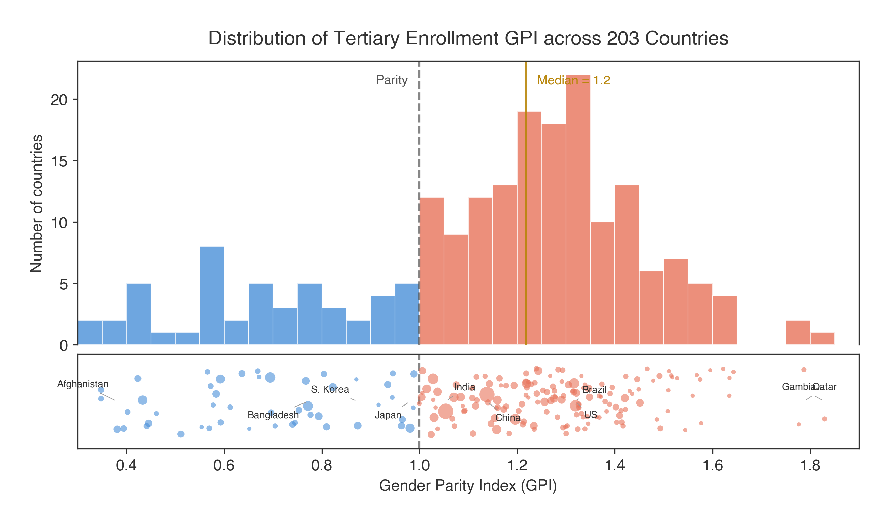
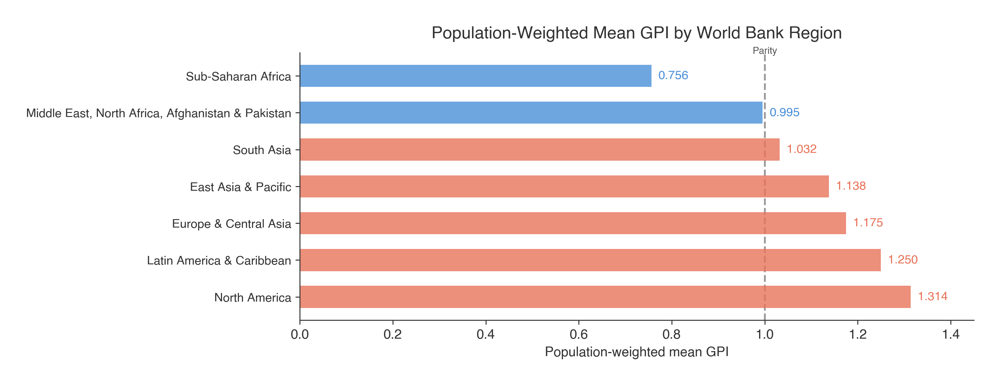
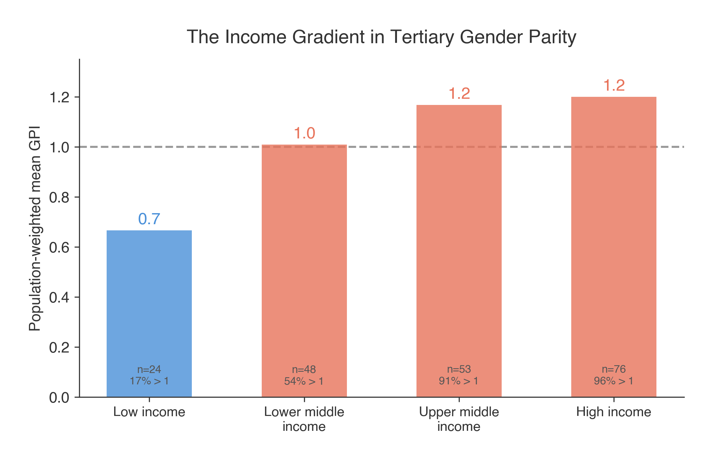
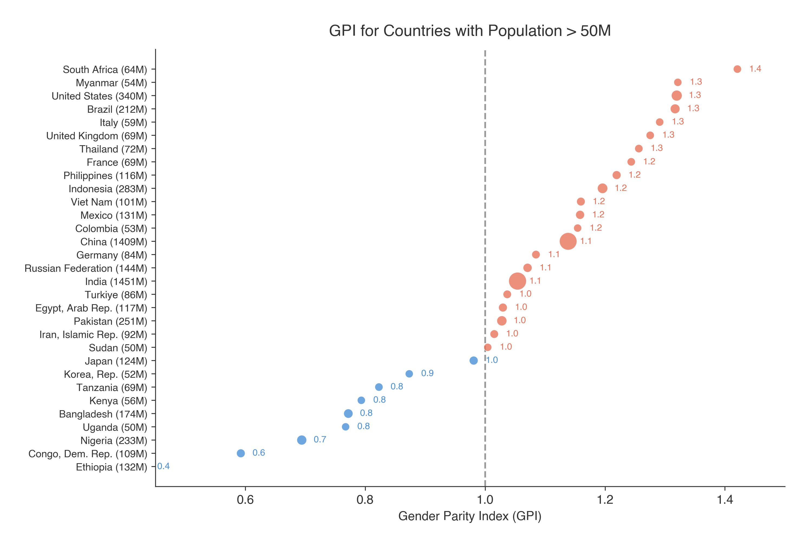
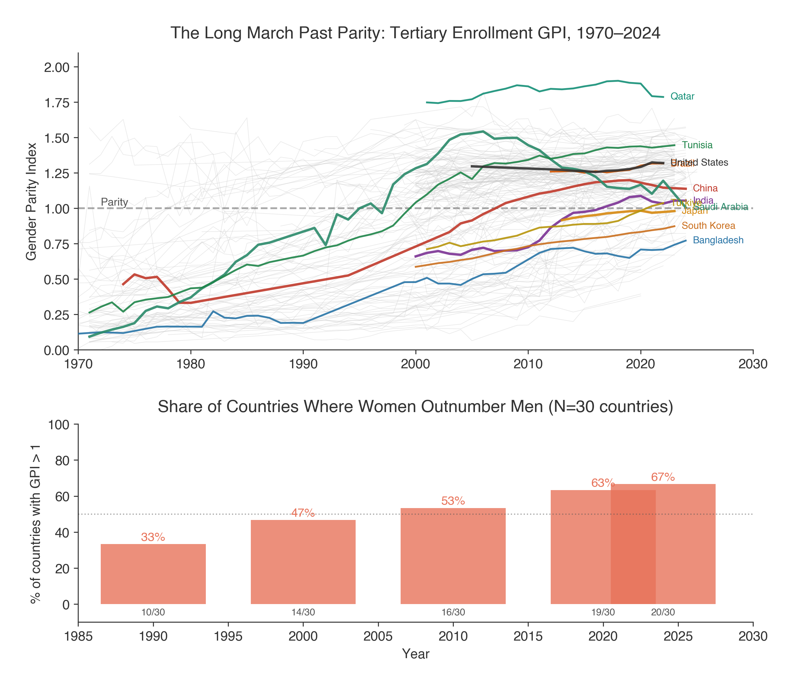
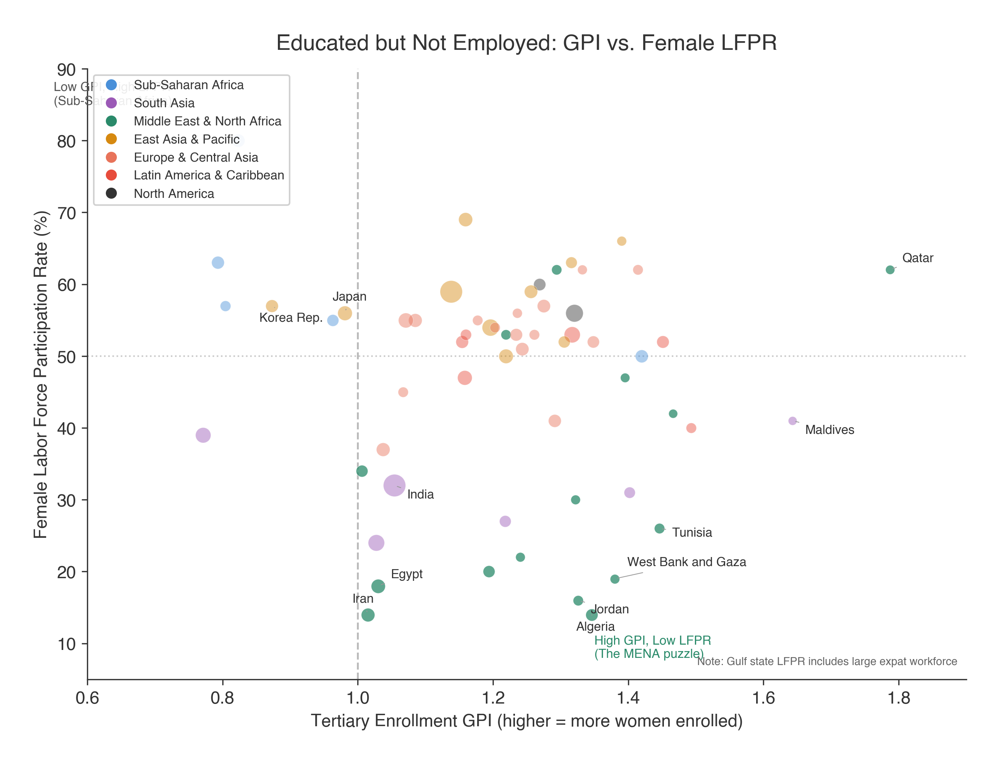

# The Other Gender Gap

In 152 of 203 countries, more women than men are enrolled in higher education. The median GPI is 1.2, but the population-weighted mean is only 1.1—the giants lag behind.

### Distribution


Three-quarters of countries (75%) now have more women than men in tertiary education.

### By Region


Latin America leads (pop-weighted GPI 1.3); Sub-Saharan Africa lags (0.8).

### By Income Group


The income gradient is monotonic: low-income 0.7 → high-income 1.2.

### Large Countries


Japan and South Korea are outliers among rich countries—still male-majority.

### Historical Trends


Using a balanced panel of countries with data from 1990 onward, we track the share with GPI > 1 over time. The reversal is striking: from a minority in 1990 to a large majority by 2024.

### Education vs Employment


In several MENA countries, women outnumber men in universities while overall female workforce participation remains low.

## Data

**Sources:**

| Indicator | World Bank Code | Description |
|:---|:---|:---|
| Tertiary GPI | `SE.ENR.TERT.FM.ZS` | Ratio of female to male gross tertiary enrollment |
| Female LFPR | `SL.TLF.CACT.FE.ZS` | Female labor force participation rate (%, 15+, ILO modeled) |
| Population | `SP.POP.TOTL` | Total population |

All data from the [World Bank Open Data](https://data.worldbank.org/) platform, sourced from UNESCO Institute for Statistics (education) and ILO (labor force). CC BY 4.0.

**Files:**

| File | Description |
|:---|:---|
| `data/gpi_tertiary_enrollment.csv` | Cross-section: 165+ economies, most recent GPI, region, income group, population |
| `data/gpi_historical.csv` | Panel: 197 countries, annual data (1970–2024), from World Bank API |
| `data/gpi_vs_lfpr.csv` | Cross-section: GPI + female LFPR for ~60 countries (all columns from World Bank API) |

To refresh the data from the World Bank API:

```bash
python scripts/01_fetch_data.py    # GPI cross-section
python scripts/01b_fetch_historical.py  # Historical panel (all years)
python scripts/02_fetch_lfpr.py    # Female LFPR
```

No API key required. All data from World Bank Open Data.

## Analysis

```bash
python scripts/03_analyze.py
```

Prints summary statistics, region and income decompositions, extremes, reversal analysis, and a big-country table. Exports `data/gpi_viz_data.json`.

## Figures

```bash
python scripts/04_make_figures.py
```

Generates six figures in `figs/`:

| Figure | Description |
|:---|:---|
| `fig1_distribution.png` | Histogram + population-scaled strip chart |
| `fig2_regions.png` | Population-weighted mean GPI by region |
| `fig3_income.png` | Population-weighted mean GPI by income group |
| `fig4_big_countries.png` | GPI dot plot for countries with pop > 50M |
| `fig5_historical.png` | Country trajectories 1970–2024 + share above parity over time |
| `fig6_gpi_vs_lfpr.png` | GPI vs. female labor force participation rate scatter |

## Repo structure

```
.
├── readme.md
├── requirements.txt
├── Makefile
├── data/
│   ├── gpi_tertiary_enrollment.csv
│   ├── gpi_historical.csv
│   └── gpi_vs_lfpr.csv
├── figs/
│   ├── fig1_distribution.png
│   ├── fig2_regions.png
│   ├── fig3_income.png
│   ├── fig4_big_countries.png
│   ├── fig5_historical.png
│   └── fig6_gpi_vs_lfpr.png
└── scripts/
    ├── 01_fetch_data.py       # Pull fresh GPI cross-section from World Bank API
    ├── 01b_fetch_historical.py # Pull full historical panel (all years) from World Bank API
    ├── 02_fetch_lfpr.py       # Update female LFPR in gpi_vs_lfpr.csv from World Bank API
    ├── 03_analyze.py          # Summary statistics and decompositions
    └── 04_make_figures.py     # Generate all 6 figures
```

## Quick start

```bash
pip install -r requirements.txt
make all
```

Or run individual steps:

```bash
make data      # Fetch data from World Bank API
make analyze   # Run analysis
make figures   # Generate figures
make clean     # Remove generated files
```

## Key findings

- **75%** of countries have GPI > 1 (female > male tertiary enrollment)
- **Historical reversal**: In a balanced panel of countries with data since 1990, the share with GPI > 1 rose from a minority to a large majority by 2024.
- **Pop-weighted mean** (1.1) is lower than the median (1.2)—the population giants lag
- **Japan and South Korea** are the only large high-income countries with GPI < 1
- **MENA paradox**: Several countries have GPI > 1 but overall female LFPR below 15%
- **Income gradient** is monotonic: low-income 0.7 → high-income 1.2

## Requirements

```
pip install -r requirements.txt
```

Python 3.9+. `01_fetch_data.py` and `02_analyze.py` use only the standard library. `03_make_figures.py` needs `matplotlib` and `numpy`.

## License

Code: MIT. Data: World Bank [Terms of Use](https://www.worldbank.org/en/about/legal/terms-of-use-for-datasets) (CC BY 4.0).
